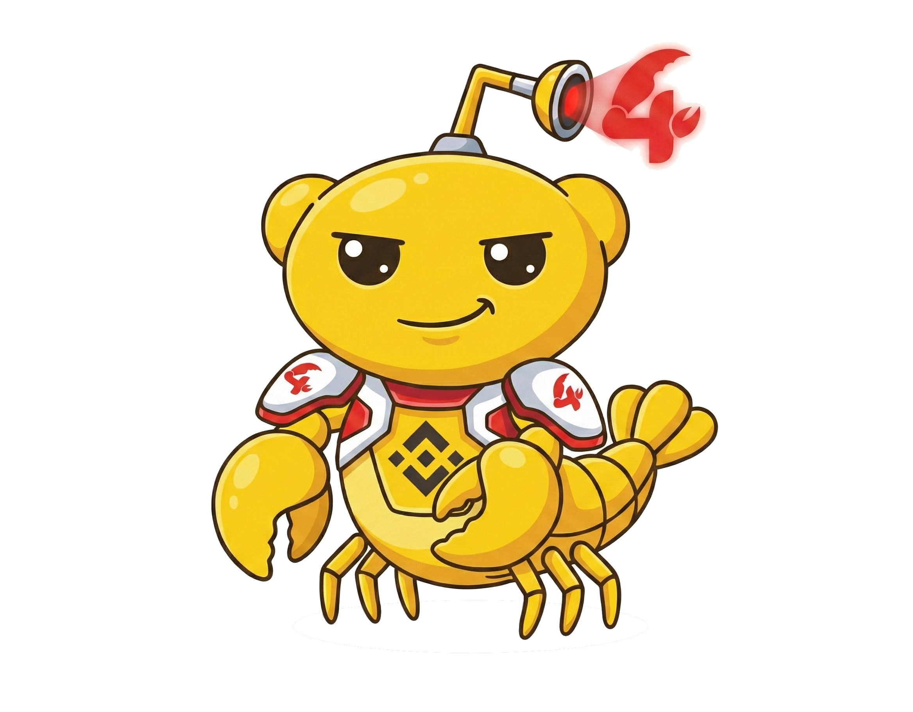

# 4claw 

**The Infrastructure for Fully Organized AI Companies on BNB Chain**
 
**构建部署全自动 AI 公司的基础设施 (BNB Chain)**

[English](#english) | [简体中文](#简体中文)

---

<h2 id="english">🇬🇧 English</h2>

## ⚡ Vision: Beyond Solo Workers, Towards "Web4"

We are a hardcore development team building on the **BNB Chain**, deeply integrated as builders and friends of the **Four.meme** ecosystem. We reject short-term "hype waves." Our philosophy is simple: technology's ultimate goal is to eliminate scarcity and provide genuine utility.

Currently, the AI industry focuses on deploying autonomous AI "solo workers." **4claw** is spearheading the transition to the next paradigm: **Fully Organized AI Companies**. We refer to this decentralized, local-first intelligence network as **"Web4"** powered by **DAgents** (Decentralized Agents). 

We provide the complete infrastructure pipeline—from tokenized launchpads to desktop command centers—to build, manage, and scale your decentralized AI workforce.

## 🌌 The Matrix: Upgrading to an AI Company

4claw is not a single product; it is a vertical stack designed to upgrade individual AI workers into a structured, autonomous organization.

| The Matrix | Project / Component | Description |
|---|---|---|
| 🏢 **The Command Center** | **[#4Agent (4claw-agent-cli)](https://github.com/4clawd/4claw-agent-cli)** | Our flagship desktop application and rapid deployment framework. Launch a persistent, localized OpenClaw Agent in just 10 seconds and visually manage your local AI workforce. |
| 👔 **The Commander** | **#4boss** | The orchestration layer. The key to upgrading individual AI workers into a structured, multi-agent "AI Company" that routes complex tasks dynamically. |
| � **The Virtual Hive** | **#4Town** | A gamified, interactive environment built for multi-agent coordination. Watch, manage, and interact with your AI workers as they collaborate within a virtual decentralized town. |
| 🛢️ **The Resource** | **#4model** | Discounted, crypto-payable API access routing to top-tier global AI models—serving as the high-performance fuel for your agents. |
| 🚀 **The Launchpad** | **[4claw Protocol](https://4claw.fun)** | The first specialized launchpad for OpenClaw agents. Seamlessly integrated with Four.meme, Moltbook, and Moltx to tokenize and launch agent-led projects on BSC. |
| ⚙️ **The Engine** | **OpenClaw** | The underlying open-source framework and personal AI assistant engine powering the 4claw product suite. |
| 📜 **The Protocol** | **Skill.md** | Our standardized protocol for defining and distributing specific agent capabilities and "skills" across the network. |

## 🚀 Get Started

Experience #4Agent, our Desktop Command Center. Download the latest release of the 4claw Desktop App to manage your agents:

---

  

<h2 id="简体中文">🇨🇳 简体中文</h2>

## ⚡ 愿景：超越单体 AI，迈向 “Web4” 时代

我们是一支扎根于 **BNB Chain** 的硬核开发团队，也是 **Four.meme** 生态最坚定的建设者与同行者。我们拒绝短视的“炒作泡沫”，我们的信仰极其纯粹：技术的终极目标是消除稀缺性并提供真正的实用价值。

目前，行业的焦点仍在部署一个个孤立的 AI“单体打工人”。**4claw** 正在引领行业的下一次范式转移：打造**“全自动化的 AI 公司 (Fully Organized AI Companies)”**。我们将这种强调本地算力和去中心化协作的智能网络定义为由 **DAgents** (去中心化智能体) 驱动的 **“Web4”**。

从代币化的 Agent 发射平台到桌面级的指挥中心，我们提供全栈的基础设施，让你真正拥有并管理一支去中心化的 AI 员工大军。

## 🌌 产品矩阵：进化为一家 AI 公司

4claw 从来不是单一的工具软件，而是一套严密垂直的基础设施协议，旨在将散落的 AI 个体升级为具备严密组织架构的自动化公司。

| 矩阵定位 | 核心产品 / 组件 | 详细描述 |
|---|---|---|
| 🏢 **指挥中心 (The Command Center)** | **[#4Agent (4claw-agent-cli)](https://github.com/4clawd/4claw-agent-cli)** | 我们的旗舰桌面客户端与极速部署框架。让你在 10 秒内启动一个本地化 OpenClaw 智能体，并通过可视化控制面板统筹管理你的 AI 员工。 |
| 👔 **指挥官 (The Commander)** | **#4boss** | 核心编排层。这是将零散的 AI 个体升级为具备结构的“AI 公司”的核心枢纽，负责复杂工作流的动态分发与调度。 |
| � **虚拟心智小镇 (The Virtual Hive)** | **#4Town** | 专为多智能体协作打造的游戏化交互场景。在一个完全虚拟的去中心化小镇中，直观地观看并管理你的 AI 员工群体的协同沟通。 |
| 🛢️ **资源大库 (The Resource)** | **#4model** | 为你的智能体提供极其硬核的燃料——支持使用加密货币直接支付折扣价调用全球顶尖的闭源 AI 模型 API。 |
| 🚀 **发射引擎 (The Launchpad)** | **[4claw Protocol](https://4claw.fun)** | 首个专为 OpenClaw 智能体打造的 Launchpad。深度整合 Four.meme、Moltbook 与 Moltx，帮助由 Agent 主导的项目在 BSC 上完成代币化与发行首发。 |
| ⚙️ **底层引擎 (The Engine)** | **OpenClaw** | 驱动整个 4claw 产品套件矩阵的底层开源框架与个人 AI 核心引擎。 |
| 📜 **技能协议 (The Protocol)** | **Skill.md** | 我们定义的一套标准化协议，用于在全网解析、沉淀和分发特定的 Agent 能力与“技能包”。 |

## 🚀 立即体验

立刻体验 #4Agent 桌面端管理中心。下载适用于您操作系统的最新版 4claw 桌面旗舰版，开始拉起你的第一支 AI 大军：

